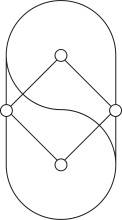

.. Skkrypto documentation master file, created by
   sphinx-quickstart on Mon Jul 23 09:43:22 2018.
   You can adapt this file completely to your liking, but it should at least
   contain the root `toctree` directive.

Skkrypto 
========

성균관대학교 블록체인 학회 Skkrypto 입니다. 

.. note:: 
	현재 사이트 보수중입니다. 양해 부탁드립니다.

Skkrypto Sites
--------------

* `Homepage <https://skkrypto.io>`_

* `Github <https://github.com/Skkrypto>`_

* `Facebook <https://www.facebook.com/skkrypto/>`_

Contents
========

.. toctree::
   :maxdepth: 2
   :caption: Contents:

Indices and tables
------------------

* :ref:`genindex`
* :ref:`modindex`
* :ref:`search`
